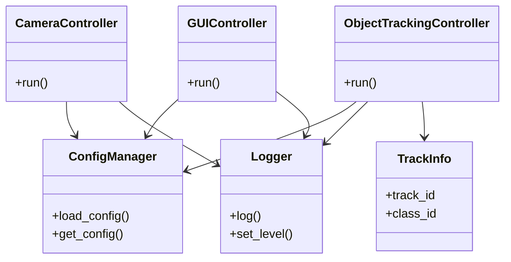

# Real-Time Multi-Process Object Tracking Application

## このアプリケーションの概要

カメラで物体検出・追跡を行うGUIアプリケーションです。
- GUI、撮像、物体検出・追跡をmultiprocessingで処理することで並列化・高速化を行います。

## 各モジュールの概要


### GUIController
- 「追跡開始」「追跡終了」ボタンを配置します。
- アプリケーションの状態（「実行中」「停止中」）を管理します。
  - 起動時は「停止中」で、カメラ画像は表示しません。
- 「追跡開始」ボタンで`CameraController`と`ObjectTrackingController`のプロセスを起動します。
- 「追跡終了」ボタンで実行中のプロセスを安全に停止させます。
- カメラのキャプチャ画像を表示します。
  - 物体検出・追跡の結果を画像にオーバーレイします。
- 物体追跡のIDをリスト表示します（IDとクラス）。
  - 受信したリストを最大10行まで表示します。
  - 物体検出・追跡が10以上の場合、リストの10行目を"..."と表示します。
- 物体検出・追跡の1フレームあたりの処理時間（ミリ秒）、平均フレームレートを表示します。
  - 表示内容: xx.xx ms, xx.xx FPS
  - 小数点第2桁までを表示します。
  - フレームレートは最大、過去100フレーム分の平均とします。
- カメラキャプチャ画像を画面の左側に、処理時間・フレームレートと追跡のリストを画面の右側に表示します。
- GUIは`tkinter`を使用します。
- CameraController、ObjectTrackingControllerと連携し、ConfigManager, Loggerを参照します。

### CameraController
- カメラはWEBカメラ(UVCカメラ)をサポートします。
- キャプチャした画像をFrameDataとして管理します。
- キャプチャした画像を保持するキューを持ちます。
  - 物体検出・追跡の処理時間によりキューのオーバーフローが発生する場合は、一番古い画像を破棄します。
- ConfigManager, Loggerを参照します。

### ObjectTrackingController
- `onnxruntime` + `supervision`で物体検出・追跡を行います。
  - 追跡するクラスは指定可能とします。
- CameraControllerから画像(FrameData)を取得し、物体検出・追跡(TrackInfo, sv.Detections)を行います。
- 追跡結果をGUIControllerに送信します。
- ConfigManager, Loggerを参照します。

### ConfigManager
- 設定ファイル（YAML）を読み込み、各Controllerに設定値を提供します。
- 設定値はdataclass等で管理します。

### Logger
- loguruをラップし、各Controllerからのログ出力を一元管理します。
- ログレベルや出力先の制御を行います。

### FrameData
- 画像データとタイムスタンプ等を保持します。

### DetectionResult
- 物体検出のバウンディングボックス、スコア、クラスID等を保持します。

### TrackInfo
- 追跡ID、クラスID、バウンディングボックス、スコア等を保持します。

## プロセス管理
- GUIのボタン操作に応じて、カメラキャプチャと物体検出・追跡のプロセスを動的に開始・終了します。
- `multiprocessing.Event`を利用し、プロセスの終了を安全に通知します。
- **アプリケーション起動時**:
  - `GUIController`のみが起動し、「停止中」状態となります。
- **「追跡開始」ボタン押下時**:
  - `GUIController`が`CameraController`と`ObjectTrackingController`のプロセスを生成し、起動します。
- **「追跡終了」ボタン押下時またはウィンドウが閉じられた際**:
  - `GUIController`が終了イベント（`multiprocessing.Event`）をセットします。
  - `CameraController`と`ObjectTrackingController`は終了イベントを監視し、イベントがセットされたらリソースを解放して安全にプロセスを終了します。

## ロギングの内容
`loguru`を利用し、ロギングを行います。
  - error
    - APIのエラー、例外が発生した
  - warning
    - カメラ制御プロセスのオーバーフローが発生した
  - info
    - 起動、終了のトレース
  - performance
    - フレームレートや処理時間の推移（例："PERFORMANCE | frame=123 | process_time=18.45ms | avg_fps=54.32"）
    - ログ出力は一定間隔（Nフレームごと、デフォルト100フレーム）でまとめて出力します。出力間隔は設定で変更可能です。

## 設定
- アプリケーションの制御には設定ファイル（YAML）を利用します。
- 設定ファイルはアプリケーション実行時の引数で指定します。  
  > --config __PATH_TO_CONFIG_FILE__

| 設定名 | | 説明 |
|:--|:--|:--|
| camera | source | カメラソース。int=デバイス番号 / 数字文字列も同様 / それ以外の文字列=動画ファイルパス・RTSP URL（既定 0） |
|  | fps | カメラのフレームレート（要求値。カメラが従う保証はない） |
|  | width | カメラの画像の幅（要求値。カメラが従う保証はない） |
|  | height | カメラの画像の高さ（要求値。カメラが従う保証はない） |
|  | max_queue_length | カメラのキューの最大数 |
| detection | model_path | 検出モデルのパス |
|  | providers | onnxruntimeの実行プロバイダー（例: ['CPUExecutionProvider']） |
|  | score_threshold | ByteTrack の追跡開始しきい値（生検出フィルタではない） |
|  | detection_threshold | 生検出 confidence の下限フィルタ（既定 0.1） |
|  | nms_iou_threshold | NMS の IoU しきい値（既定 0.45） |
|  | class_names | 検出モデルのクラス名リスト（表示用） |
| tracking | class_id | 追跡するクラスIDのリスト |
|  | max_lost | 最大消失フレーム数 |
|  | min_box_area | 追跡対象とする最小バウンディングボックス面積 |
|  | iou_threshold | 検出と追跡の紐付けIoU閾値 |
|  | frame_read_policy | フレーム読み出しポリシー。fifo=全フレーム処理 / latest=最新まで読み飛ばし / bounded_latest=最大 max_frame_skip 件まで読み飛ばし（既定 bounded_latest。不正値は警告の上 bounded_latest にフォールバック） |
|  | max_frame_skip | bounded_latest 時に読み飛ばす最大フレーム数（既定 2） |
| gui | window_width | ウィンドウの幅 |
|  | window_height | ウィンドウの高さ |
|  | window_x | ウィンドウ表示位置（X座標） |
|  | window_y | ウィンドウ表示位置（Y座標） |
|  | display_image_width | カメラ画像表示サイズ（幅） |
|  | display_image_height | カメラ画像表示サイズ（高さ） |
|  | frame_buffer_seconds | 追跡結果との同期表示用にカメラフレームを保持する秒数（既定 2.0） |
| logging | level | ログレベル（INFO, DEBUG, WARNING, ERROR） |
|  | output | ログ出力先（console=標準出力。それ以外の文字列はファイルパスとして出力） |
|  | performance_interval | performanceログの出力間隔（Nフレームごと、デフォルト100） |

## モジュール構成図




## フォルダ構成

```
python_multiprocessing_example/
├── config/
│   └── default.yaml
├── models/
│   └── yolox_s.onnx
├── src/
│   ├── __init__.py
│   ├── main.py
│   ├── camera_controller.py
│   ├── object_tracking_controller.py
│   ├── gui_controller.py
│   ├── config_manager.py
│   ├── logger.py
│   └── data_models.py
├── tests/
│   └── ...
├── .gitignore
├── README.md
└── requirements.txt
```

## 開発言語と利用するOSS

### 開発言語
- Python

### 利用OSS

| OSS名 | 用途 |
|:--|:--|
| [opencv-python](https://pypi.org/project/opencv-python/) | カメラキャプチャや画像処理で利用 |
| [onnxruntime](https://pypi.org/project/onnxruntime/) | 物体検出 |
| [supervision](https://github.com/roboflow/supervision) | 物体追跡 |
| [loguru](https://pypi.org/project/loguru/) | ロギング |
| [PyYAML](https://pypi.org/project/PyYAML/) | 設定ファイル（YAML）の読み込み |
| [numpy](https://numpy.org/) | 画像・推論結果の操作 |
| [Pillow](https://pypi.org/project/Pillow/) | GUIでの画像表示 |

## ライセンス
- MIT Licence