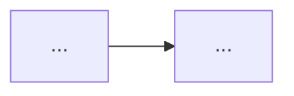

# Design — <feature-name>

> 雛形。対象機能が「どう実現されているか（逆生成）/されるか（新規）」を記す。
> コードが正。関連コードパスは `file:line` で示す。

## 概要

<この機能の設計を1〜3段落で。何を解決し、どんな構造で実現しているか。>

## 責務と構成要素

| 要素（クラス/関数） | 役割 | 出典 |
|:--|:--|:--|
| `<ClassName>` | <役割> | `src/<module>.py:NN` |

## 公開インターフェース

```
# 主要な公開メソッド/関数のシグネチャと意味
<class>.<method>(args) -> ret   # <説明>（src/<module>.py:NN）
```

## データ構造 / 状態

- <保持する状態、IPC データ構造、Queue/共有メモリ等。出典付き>

## データフロー / 制御フロー

<処理の流れ。必要なら Mermaid（sequence/flowchart）で図示。>



## 不変条件 / 前提条件

- <常に成り立つべき条件、呼び出し前提、スレッド/プロセス安全性。出典付き>

## エッジケース / 異常系

- <空/満杯/競合/タイムアウト等で何が起きるか。出典付き>

## トレードオフ / 設計判断

- <なぜこの設計か。代替案、性能とのバランス。コードから読めない場合は「推測」と明記>

## 関連コードパス

- `src/<module>.py:NN-MM` — <説明>
