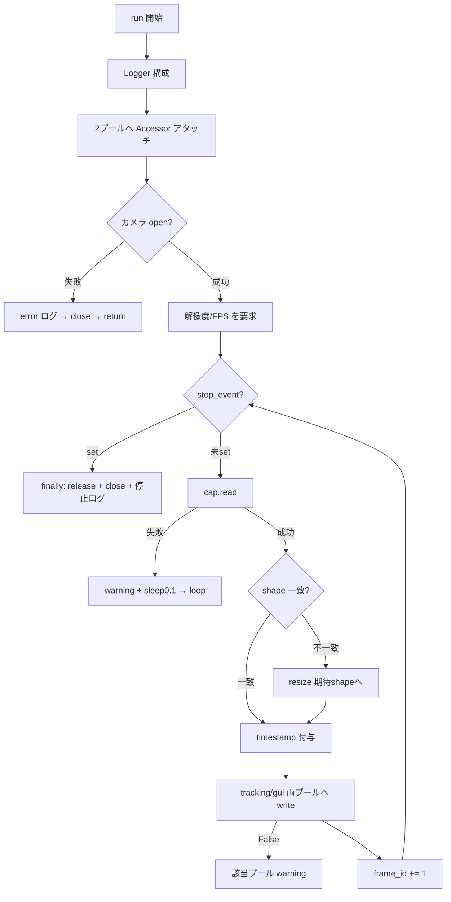

# Design — camera-controller

> 逆生成 spec。`src/camera_controller.py` が「どう実現されているか」を記す。コードが正。
> 関連: [`shared-frame-pool`](../shared-frame-pool/)（書き込み先）、[`structure.md`](../../steering/structure.md) の IPC 規約、[`config-manager`](../config-manager/)・[`logger`](../logger/)。

## 概要

`camera-controller` は撮像専用のワーカープロセスである。`multiprocessing.Process` を継承し、`run()` の中で OpenCV カメラを開き、フレームを取得して**追跡用**と**GUI 表示用**の2つの共有メモリプール（`SharedFramePool`）へゼロコピー方式で書き込む。Queue には画像本体ではなく `FrameRef`（プール側が publish）だけが流れる。出典 `src/camera_controller.py:17-94`。

設計の要点は、① **共有メモリへのアタッチを子プロセス内で行う**（spec のみ pickle 転送）、② **取得フレームを期待 shape へ正規化**してからスロットへコピー（カメラが要求解像度に従わない場合のセーフティネット）、③ **両プールへ同一フレームを書き分ける**（追跡と表示で消費ポリシーが異なるため別プール）、④ **`stop_event` による協調停止**と `finally` での確実な後始末、の4点である。

## 責務と構成要素

| 要素 | 役割 | 出典 |
|:--|:--|:--|
| `CameraController.__init__` | 設定・spec・stop_event を保持、`frame_id=0` | `src/camera_controller.py:18-33` |
| `CameraController.run` | ロガー構成→アタッチ→カメラ open→取得ループ→後始末 | `src/camera_controller.py:35-94` |

## 公開インターフェース

```
CameraController(config_manager, logging_config,
                 tracking_pool_spec, gui_pool_spec, stop_event)   # src/camera_controller.py:18-25
.start()   # multiprocessing.Process 由来。子プロセスで run() を実行（GUI が呼ぶ）
.run()     # 撮像ループ本体（src/camera_controller.py:35）
# 停止は共有する stop_event.set() で行う（owner = GUI）
```

## データ構造 / 状態

- インスタンス状態: `config`（camera 設定）、`logging_config`、`tracking_pool_spec`/`gui_pool_spec`、`stop_event`、`frame_id`、`logger`。出典 `src/camera_controller.py:27-33`。
- 子プロセス内ローカル: `tracking_pool`/`gui_pool`（`SharedFrameAccessor`）、`cap`（`cv2.VideoCapture`）。出典 `src/camera_controller.py:40-43`。
- 書き込み先プールの形状 `(height, width, 3)` は GUI が生成。出典 `src/gui_controller.py:67`。

## データフロー / 制御フロー



出典: `src/camera_controller.py:35-94`。

## 不変条件 / 前提条件

- **子プロセス内アタッチ**: `SharedFrameAccessor` は `run()` 内で生成（spec のみ転送）。出典 `src/camera_controller.py:39-41`。
- **両プール同一 shape**: GUI が両プールを同一 `frame_shape` で生成するため、`tracking_pool.shape` 基準のリサイズで GUI 用にも適合。出典 `src/gui_controller.py:80-91`、`src/camera_controller.py:65`。
- **`frame_id` 単調・再起動でリセット**: 出典 `src/camera_controller.py:32,88`。
- **協調停止 + finally 後始末**: `stop_event` 監視、`finally` で release/close。出典 `src/camera_controller.py:55,90-94`。

## エッジケース / 異常系

- **カメラ open 失敗**: error ログ→両プール close→`return`（プロセス終了）。**改修予定**: 加えて GUI へオープン失敗を通知（R-CAM-14）。出典 `src/camera_controller.py:44-48`。
- **frame grab 失敗**: warning→`sleep(0.1)`→continue。`stop_event` まで無限リトライ（**正式仕様**、R-CAM-07）。出典 `src/camera_controller.py:57-60`。
- **shape 不一致（h/w）**: `resize` で補正。出典 `src/camera_controller.py:65-69`。
- **shape 不一致（チャンネル数）**: `resize` では補正できない。**改修予定**: 明示的に検出し error ログ＋ドロップして継続（R-CAM-15）。現状は `write` 側 `if frame.shape != self.shape: return False` の warning のみ。出典 `src/shared_frame_pool.py:175-177`。
- **プール満杯/競合**: `write` が False（プール側で evict-oldest 後も put 失敗 or consumer 競合）。CameraController は warning を出し継続。出典 `src/camera_controller.py:76-85`、`src/shared_frame_pool.py:179-201`。

## トレードオフ / 設計判断

- **2プール分離**: 追跡（読み飛ばしポリシー有り）と表示（最新優先）で消費特性が違うため、同一フレームを別プールへ書く。重複コピーのコストより、消費側の独立性を優先（**推測**）。
- **リサイズはセーフティネット**: 多くのカメラは要求解像度に従うが、従わない個体に備え `resize` で必ずスロット形状へ合わせる。出典コメント `src/camera_controller.py:62-64`。
- **カメラソースの設定化（確定）**: `VideoCapture(0)` 固定をやめ `camera.source`（int or 文字列）で指定可能にする（R-CAM-13a〜d）。型解釈は**ルール B**: int→デバイス、`^\d+$` 文字列→int 化してデバイス、それ以外の文字列→パス/URL。`"0"` でもデバイス0になり YAML が int/str いずれでも頑健。「`0` という名前のファイル」は開けないが現実的に問題なしと判断。GStreamer パイプラインは `cv2.CAP_GSTREAMER` 必須のため対象外（将来 `camera.api_preference`）。
- **オープン失敗の GUI 通知（機構確定）**: プロセスの自然死とエラー終了を区別するため、GUI へ**専用エラー通知**を送る（R-CAM-14、[`gui-controller`](../gui-controller/) R-GUI-44 と共通）。GUI は既にプロセス `is_alive` を監視する（`src/gui_controller.py:478`）が、死活だけではエラー要因を区別できないため明示通知を足す。機構はエラー内容を運べる**ステータス Queue を推奨**（tracking R-OTC-23 と共通、最終形は実装時確定）。
- **チャンネル不一致はエラー扱い（確定）**: 黙ったドロップではなく error ログ＋ドロップで可視化（R-CAM-15）。
- **追加スリープ無し**: `cap.read()` のブロッキングに FPS ペーシングを委譲。出典 `src/camera_controller.py:89`。

## 関連コードパス

- `src/camera_controller.py:17-94` — `CameraController` 本体
- `src/shared_frame_pool.py:153-201,273` — `SharedFrameAccessor`（write/shape/close）
- `src/gui_controller.py:67,80-91,379-397` — プール生成・プロセス生成/起動
- `src/config_manager.py:12-17` — `CameraConfig`（fps/width/height）
