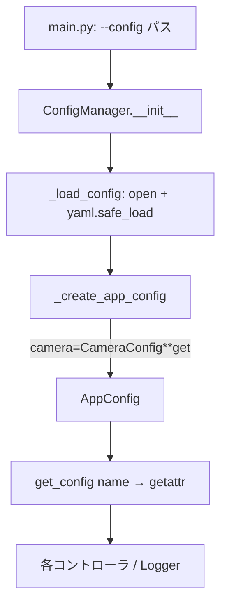

# Design — config-manager

> 逆生成 spec。`src/config_manager.py` が「どう実現されているか」を記す。コードが正。
> 関連: [`structure.md`](../../steering/structure.md) の命名・記述規約、`config/default.yaml`、README 設定表。

## 概要

`config-manager` は、YAML 設定ファイルを **dataclass 階層**（`AppConfig` → 5つのセクション dataclass）へマッピングして読み込み、各コントローラへ型付きの設定オブジェクトを提供するモジュールである。全プロセス（GUI/camera/object_tracking）が `ConfigManager.get_config(section)` を通じて設定を参照する横断ユーティリティ。出典 `src/config_manager.py:73-97`。

設計の要点は3つ。① **スキーマを dataclass で表現**し、全フィールドにデフォルト値を持たせることで、YAML に書かれなかった項目を既定値で補う。② **セクション欠落に寛容**（`dict.get(section, {})`）だが、**未知キーには厳格**（`**` 展開で `TypeError`）。③ **値の妥当性検証は行わない**（型・値域は消費側責務）。シンプルさを優先した薄いローダである。

## 責務と構成要素

| 要素 | 役割 | 出典 |
|:--|:--|:--|
| `CameraConfig` | カメラ設定（source/fps/width/height/max_queue_length） | `src/config_manager.py:12-19` |
| `DetectionConfig` | 検出設定（model_path/providers/score_threshold/detection_threshold/nms_iou_threshold/class_names） | `src/config_manager.py:22-29` |
| `TrackingConfig` | 追跡設定（class_id/max_lost/min_box_area/iou_threshold/frame_read_policy/max_frame_skip） | `src/config_manager.py:32-39` |
| `GuiConfig` | GUI 設定（window_*/display_image_*/frame_buffer_seconds） | `src/config_manager.py:42-50` |
| `LoggingConfig` | ログ設定（level/output/performance_interval） | `src/config_manager.py:53-57` |
| `AppConfig` | 5セクションを束ねる集約 dataclass | `src/config_manager.py:60-66` |
| `EmptyConfigError` | 空設定ファイル（YAML が `None`）検出時の専用例外（`ValueError` 派生） | `src/config_manager.py:69-70` |
| `ConfigManager` | YAML 読み込み・`AppConfig` 構築・`get_config` 提供 | `src/config_manager.py:73-97` |

## 公開インターフェース

```
ConfigManager(config_path: str)                    # 生成時に YAML を読み AppConfig を構築（src/config_manager.py:74-75）
ConfigManager.get_config(name: str) -> Any         # セクション名で設定オブジェクトを取得（src/config_manager.py:96-97）

# 内部メソッド
_load_config(config_path) -> AppConfig             # open(utf-8)+safe_load+空検証（src/config_manager.py:77-85）
_create_app_config(config_dict) -> AppConfig       # セクション dict を各 dataclass へ展開（src/config_manager.py:87-94）

# 例外
EmptyConfigError(ValueError)                        # 空設定ファイル（src/config_manager.py:69-70）
```

## データ構造 / 状態

- `ConfigManager` は唯一の状態 `self.config: AppConfig` を保持する（生成時に確定、以後不変として扱う）。出典 `src/config_manager.py:75`。
- 各セクション dataclass は `field(default_factory=...)` で可変デフォルト（`list`）を安全に定義する。出典 `src/config_manager.py:25,29,34`。
- `CameraConfig.source` は `Union[int, str]`（既定 `0`）。型解釈は消費側（`CameraController._resolve_camera_source`）が担う。出典 `src/config_manager.py:14-15`、[`camera-controller`](../camera-controller/)。
- `DetectionConfig` のしきい値群（`score_threshold`/`detection_threshold`/`nms_iou_threshold`）は用途が異なる別キー。出典 `src/config_manager.py:26-28`、[`object-tracking-controller`](../object-tracking-controller/)。
- 全キーの定義（既定値）と消費側の対応は requirements.md「設定キー一覧」を正とする。

## データフロー / 制御フロー



- 生成: `main.py:31` が `args.config`（既定 `../config/default.yaml`）で `ConfigManager` を生成。出典 `src/main.py:21-31`。
- 読込: `_load_config` が `open(utf-8)`→`yaml.safe_load`→空検証→`_create_app_config`。出典 `src/config_manager.py:77-85`。
- 構築: `_create_app_config` が各セクションを `**config_dict.get(section, {})` で対応 dataclass へ展開。出典 `src/config_manager.py:87-94`。
- 取得: 各コントローラはコンストラクタで `get_config("camera")` 等を呼び、サブ設定を保持する。出典 `src/camera_controller.py:29`、`src/object_tracking_controller.py:36-38`、`src/gui_controller.py:50-51`。

## 不変条件 / 前提条件

- **デフォルト完備**: 全フィールドにデフォルトがあるため、欠落セクションは全デフォルトで構築される（R-CM-04）。出典 `src/config_manager.py:15-57,87-94`。
- **未知キー拒否**: `**` 展開のため、タイプミス等の未定義キーは `TypeError` で即座に検出される（R-CM-07）。出典 `src/config_manager.py:87-94`。
- **UTF-8 読み込み**: 設定ファイルは UTF-8 固定で読む（R-CM-11）。プラットフォーム既定（cp932 等）に依存しない。出典 `src/config_manager.py:78-81`。
- **未消費キーを持たない**: スキーマの全キーは `src/` のいずれかで消費される（R-CM-12）。未消費だった `detection.fp16` / `tracking.max_track_num` は削除済み。
- **検証の非対称性**: 「キーの存在」は厳格、「値の妥当性」は無検証。後者は消費側が担う（例: `frame_read_policy` の不正値は `object_tracking_controller.py:75-80` で `bounded_latest` にフォールバック）。

## エッジケース / 異常系

- **ファイル無し**: `open` が `FileNotFoundError`（R-CM-06）。`main.py:38-40` が捕捉して終了。出典 `src/config_manager.py:81`。
- **空ファイル**: `yaml.safe_load` が `None` を返すと、`_load_config` が **`EmptyConfigError`**（パス付きメッセージ）を送出する（R-CM-09、**実装済み**）。`main.py:41-43` の専用ハンドラが stderr 出力＋`exit(1)`。出典 `src/config_manager.py:83-84`、`src/main.py:41-43`。
- **未知キー**: `TypeError`（R-CM-07）。`main.py` の汎用 `except` 行き。削除済みキー（`fp16`/`max_track_num`）を含む旧設定ファイルもここに該当する（R-CM-12）。
- **不明セクション取得**: `get_config("xxx")` が `AttributeError`（R-CM-08）。出典 `src/config_manager.py:97`。
- **型不一致値**: `fps: "abc"` のような誤った型でも検証されず格納され、消費時に初めて失敗し得る（R-CM-10）。出典 `src/config_manager.py:87-94`。
- **非 UTF-8 バイト列**: UTF-8 として不正なファイルは `open(encoding="utf-8")` が `UnicodeDecodeError` を送出（R-CM-11、`main.py` 汎用 `except` 行き）。出典 `src/config_manager.py:81`。

## トレードオフ / 設計判断

- **薄いローダに徹する**: バリデーションを持たず dataclass デフォルト＋`**` 展開のみ。実装は最小だが、値域チェックやスキーマバージョニングは無い（**推測**: シンプルさ優先）。
- **未知キー厳格 / 値無検証**: タイプミスは弾くが、値の不正は消費側まで遅延する。中途半端に見えるが「構造は守る・意味は使う側が知る」という分担（**推測**）。
- **`camera.source` の型解釈は消費側に委譲（実装済み）**: スキーマは `Union[int, str]` で値を素通しし、int/数字文字列/パスURL の解釈（ルール B）は `CameraController._resolve_camera_source` が行う。ConfigManager に検証を持ち込まない方針と一致。出典 `src/config_manager.py:14-15`、`src/camera_controller.py:51-61`。
- **未消費キーの削除（実装済み）**: `detection.fp16` と `tracking.max_track_num` をスキーマ・`default.yaml`・README 設定表から削除済み（R-CM-12）。FP16 は ONNX モデルを FP16 で作成して対応するため設定キー不要、`max_track_num` は用途無し。requirements「確定事項」参照。回帰テスト `ConfigManagerTest::test_removed_keys_are_rejected`。
- **ハードコード値を設定キー化（実装済み）**: 生検出フィルタ `0.1`・NMS IoU `0.45` を `DetectionConfig` の `detection_threshold` / `nms_iou_threshold` へ昇格し、消費側を設定値へ差し替えた（`object_tracking_controller.py:127,129`）。なお `score_threshold` は ByteTrack 活性化閾値、`tracking.iou_threshold` は ByteTrack マッチング閾値で、いずれも NMS とは別物。命名で混同を避ける。出典 `src/config_manager.py:26-28`、`src/object_tracking_controller.py:165,167,127,129`。
- **空ファイル検証は専用例外（実装済み）**: `_load_config` で `None` を検出し `EmptyConfigError`（`ValueError` 派生）をパス付きメッセージで送出する。`main.py` は `FileNotFoundError` と同じく専用ハンドラで捕捉し、ユーザーに分かりやすいメッセージで終了する。出典 `src/config_manager.py:69-70,83-84`、`src/main.py:41-43`。
- **設定は UTF-8 固定で読む（実装済み）**: `open(encoding="utf-8")` によりプラットフォーム既定エンコーディング（cp932 等）に依存せず、非 ASCII の値/コメントでも安全に読める。出典 `src/config_manager.py:78-81`。

## 関連コードパス

- `src/config_manager.py:12-97` — 全スキーマ + `EmptyConfigError` + `ConfigManager`
- `src/main.py:21-43` — 生成・引数・例外ハンドリング
- `src/camera_controller.py:29` / `src/object_tracking_controller.py:36-38` / `src/gui_controller.py:50-51` — `get_config` 消費
- `src/logger.py:13-23` — `LoggingConfig`（level/output）消費
- `config/default.yaml:1-45` — 既定設定値（コードのデフォルトと別に YAML 側で上書き）
