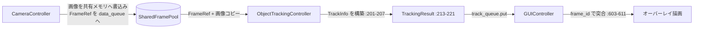

# Design — data-models

> 逆生成 spec。`src/data_models.py` が「どう構成されているか」を記す。コードが正。
> 関連: [`structure.md`](../../steering/structure.md) の IPC 規約、[`shared-frame-pool`](../shared-frame-pool/)。

## 概要

`data_models` は、プロセス間通信（IPC）で受け渡す値オブジェクトを `@dataclass` として一箇所に集約するモジュールである。本アプリは「撮像（CameraController）」「推論+追跡（ObjectTrackingController）」「表示（GUIController）」を別プロセスで動かし、`multiprocessing.Queue` と共有メモリで連携する。Queue を流れる構造体をここに集めることで、IPC スキーマの一覧性と一貫性を確保する。出典 `src/data_models.py:12-67`。

中心は2系統のデータである。① **フレーム参照系**（`FrameData` / `FrameRef`）— 画像を扱う。実運用では画像本体を Queue に流さず、共有メモリスロットに置いて軽量参照 `FrameRef` のみを流す（ゼロコピー、詳細は [`shared-frame-pool`](../shared-frame-pool/)）。② **検出/追跡結果系**（`DetectionResult` / `TrackInfo` / `TrackingResult`）— 推論+追跡の出力を GUI へ渡す。

なお `FrameData` と `DetectionResult` は **現状コードから参照されておらず、削除対象**である（README とクラス図にのみ登場する古い実装の残骸）。実フレーム転送は `FrameRef` + 生 `np.ndarray`、検出結果は `sv.Detections` を直接扱う形で代替済み。除去タスクは tasks.md 参照。

## 責務と構成要素

| 要素（dataclass） | 役割 | 利用状況 | 出典 |
|:--|:--|:--|:--|
| `FrameData` | 画像本体+メタ（frame_id/timestamp/image）を保持 | **src 未使用・削除対象**（README のみ） | `src/data_models.py:12-16` |
| `FrameRef` | 共有メモリスロットへの軽量参照（frame_id/timestamp/slot） | shared_frame_pool / object_tracking が使用 | `src/data_models.py:19-25` |
| `DetectionResult` | 検出のボックス/スコア/クラスID（list 表現） | **src 未使用・削除対象**（README のみ） | `src/data_models.py:28-32` |
| `TrackInfo` | 追跡1件（track_id/class_id/box/score） | object_tracking が生成、GUI が消費 | `src/data_models.py:35-40` |
| `TrackingResult` | 1フレーム分の追跡出力+レイテンシ計測値 | object_tracking が生成、GUI が消費 | `src/data_models.py:43-53` |
| `WorkerError` | ワーカーの致命エラー通知（source/message/timestamp） | camera/object_tracking が生成、GUI が消費 | `src/data_models.py:56-67` |

## 公開インターフェース

すべて `@dataclass`。コンストラクタはフィールド順の位置/キーワード引数。

```
FrameData(frame_id: int, timestamp: float, image: np.ndarray)                    # src/data_models.py:12-16
FrameRef(frame_id: int, timestamp: float, slot: int)                             # src/data_models.py:19-25
DetectionResult(boxes: List[List[float]], scores: List[float],
                class_ids: List[int])                                            # src/data_models.py:28-32
TrackInfo(track_id: int, class_id: int, box: List[float], score: float)         # src/data_models.py:35-40
TrackingResult(frame_id: int, timestamp: float,
               track_infos: List[TrackInfo], detections: Any,
               process_time_ms: float,
               queue_latency_ms: float = 0.0,                                    # 任意（後方互換）
               total_latency_ms: float = 0.0)                                    # 任意（後方互換）
                                                                                # src/data_models.py:43-53
WorkerError(source: str, message: str, timestamp: float)                         # src/data_models.py:56-67
```

## データ構造 / 状態

- 本モジュールは **状態を持たない**（純粋なデータ定義）。各 dataclass はミュータブルだが、IPC では「生成側で詰める→Queue で転送→消費側で読む」という一方向の値受け渡しに使う。
- `TrackingResult.detections` は `Any` 注釈で、実体は `supervision.Detections`（推論+NMS+追跡後の `tracked_detections`）。出典 `src/object_tracking_controller.py:232`、`src/data_models.py:50`。
- `TrackInfo.box` は `xyxy`（左上・右下）座標の `list[float]`（numpy を `tolist()` 済み）。出典 `src/object_tracking_controller.py:219`。
- `WorkerError` は状態を持たない通知用の値。`source` は `"camera"`/`"tracking"`、`message` は人間可読の理由、`timestamp` は送出時刻。ワーカーが `error_queue` に put し GUI が消費する。出典 `src/data_models.py:56-67`、`src/camera_controller.py:38-48`、`src/object_tracking_controller.py:46-56`。

## データフロー / 制御フロー



- **生成**: `ObjectTrackingController` が推論→NMS→`sv.ByteTrack` 後、追跡ごとに `TrackInfo` を作り、`TrackingResult` にまとめて `track_queue` へ put（満杯時は最古を捨てる）。出典 `src/object_tracking_controller.py:213-250`。
- **消費**: `GUIController` が最新 `TrackingResult` を保持し、`process_time_ms`/`queue_latency_ms`/`total_latency_ms` を性能表示へ、`track_infos`/`detections` をオーバーレイ描画へ使う。出典 `src/gui_controller.py:555-611,701-728`。
- **突き合わせ**: GUI は `TrackingResult.frame_id` をキーに、バッファ済みのカメラ画像（`_frame_buffer[fid]`）と結合して描画する。出典 `src/gui_controller.py:603-611`。

## 不変条件 / 前提条件

- **picklable であること**: `multiprocessing.Queue` 転送のため、各フィールドは picklable。`TrackInfo` は `int`/`float`/`list` に明示キャストして詰める。出典 `src/object_tracking_controller.py:216-222`。
- **`frame_id` の一貫性**: `TrackingResult.frame_id == FrameRef.frame_id`（同一フレーム由来）。GUI の突合がこれに依存。出典 `src/object_tracking_controller.py:229`。
- **後方互換**: 消費側は `queue_latency_ms`/`total_latency_ms` を `getattr(..., 0.0)` で読み、欠落を許容。`process_time_ms` は直接アクセス（当初からの必須）。出典 `src/gui_controller.py:566-572`、`src/data_models.py:52-53`。
- **レイテンシ恒等式**: `total_latency_ms == queue_latency_ms + process_time_ms`（同一 `start_time`/`end_time`/`timestamp` 由来、浮動小数誤差を除く）。出典 `src/object_tracking_controller.py:163-165,224-226`。
  - `queue_latency_ms` = 撮像→推論開始（入力遅延。内部名 `last_input_lag_ms`、共有プール待ち含む）。`process_time_ms` = 推論開始→終了。`total_latency_ms` = 撮像→終了。

## エッジケース / 異常系

- **追跡ゼロ**: `tracked_detections.tracker_id is None` のとき `track_infos` は空リスト。`TrackingResult` 自体は生成される。出典 `src/object_tracking_controller.py:214-222`。
- **旧フォーマット受信**: レイテンシ2フィールドが無い旧 `TrackingResult` でも、GUI 側 `getattr` で `0.0` 扱い。出典 `src/gui_controller.py:567-572`。
- **`detections` 欠損/型不一致**: `Any` のため型チェックされない。非 `sv.Detections` が入ると消費側の描画（`gui_controller.py:611` 周辺）で失敗し得る（呼び出し規約に依存）。

## トレードオフ / 設計判断

- **dataclass 集約**: IPC スキーマを1ファイルに集めることで、新メッセージ追加時の参照先を一意化（steering の規約と一致）。出典 `docs/steering/structure.md:47`。
- **`FrameData` を流さず `FrameRef` を流す**: 大きな `np.ndarray` の pickle コストを避けるゼロコピー設計。`FrameData`（画像同梱）は古い実装の名残で**削除対象**。詳細は [`shared-frame-pool`](../shared-frame-pool/)。
- **`detections: Any`**: `supervision` 型への静的依存を data_models から外し、循環/重依存を避けた（**推測**）。代償として型安全性は失われる。`Any` 維持が方針（requirements「確定事項」参照）。
- **`track_infos` と `detections` の二重持ち → 解消方針確定**: `TrackInfo.box`/`score` は未消費でボックス描画は `detections` 側が担う（`src/gui_controller.py:585,660`）。`detections` を正とし、`TrackInfo` は `track_id`/`class_id` の2フィールドへ縮小する（削除タスク化、requirements「確定事項」参照）。
- **レイテンシ2値のデフォルト化**: `process_time_ms`（必須）の後ろに追加したため **dataclass の文法制約**でデフォルトが必須。併せて5引数のみの既存生成箇所との後方互換も確保。コミット `0ded396` でフィールド・生成側・消費側 `getattr` を同時追加。出典 `src/data_models.py:52-53`、`src/gui_controller.py:567-572`。

## 関連コードパス

- `src/data_models.py:12-67` — 全 dataclass 定義（`WorkerError` 含む）
- `src/object_tracking_controller.py:214-236` — `TrackInfo`/`TrackingResult` の生成
- `src/gui_controller.py:555-611,701-728` — `TrackingResult` の消費（性能表示・オーバーレイ）
- `src/camera_controller.py:38-48` / `src/object_tracking_controller.py:46-56` — `WorkerError` の生成（`_report_error`）
- `src/shared_frame_pool.py:184-255` — `FrameRef` の publish/取得（詳細は [`shared-frame-pool`](../shared-frame-pool/)）
- `tests/test_shared_frame_pool.py:180,215,218` — `FrameRef` のテスト内生成
