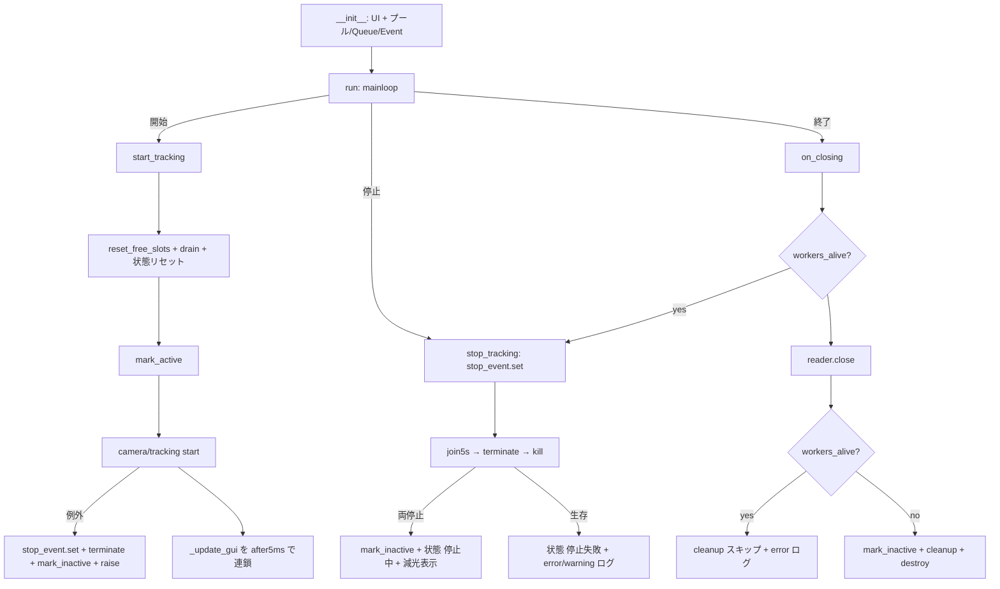
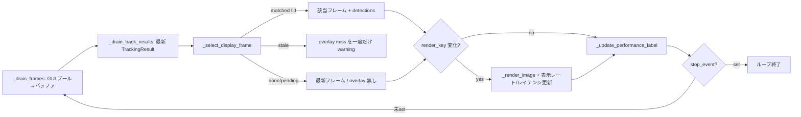

# Design — gui-controller

> 逆生成 spec。`src/gui_controller.py` が「どう実現されているか」を記す。コードが正。
> 関連: [`shared-frame-pool`](../shared-frame-pool/)（所有するプール）、[`camera-controller`](../camera-controller/) / [`object-tracking-controller`](../object-tracking-controller/)（生成するワーカー）、[`data-models`](../data-models/)（`TrackingResult`）、[`config-manager`](../config-manager/)・[`logger`](../logger/)。

## 概要

`gui-controller` はアプリのメインプロセス兼オーケストレータである。tkinter による全画面 UI を構築し、IPC リソース（2つの共有メモリプール・3つの `Queue`・`stop_event`）を **owner として所有**する。「開始」でワーカープロセス（[`camera-controller`](../camera-controller/) / [`object-tracking-controller`](../object-tracking-controller/)）を起動し、「停止」で協調停止＋強制終了フォールバックにより確実に終わらせ、「終了」で共有メモリを解放する。出典 `src/gui_controller.py:30-723`。

表示面の要点は、① GUI 用プールから読んだフレームを `frame_id` キーでバッファし、② 最新 `TrackingResult` の `frame_id` に一致するフレームへオーバーレイを描く（**フレームと検出の同期表示**）、③ 一致が破棄済みなら最新フレームをオーバーレイ無しで出す、④ render_key 差分で**無駄な再描画を抑止**、の4点。制御面の要点は、⑤ `mark_active`/`mark_inactive` とプロセス join/terminate/kill の段階的停止で**共有メモリの二重所有・リークを防ぐ**こと。

## 責務と構成要素

| 要素 | 役割 | 出典 |
|:--|:--|:--|
| `__init__` | UI 構築、プール/Queue/Event 生成、状態初期化 | `src/gui_controller.py:46-132` |
| `_calculate_frame_buffer_max` | バッファ上限算出（秒×fps と最小値の大きい方） | `src/gui_controller.py:39-44` |
| `_configure_borderless_maximized` / `_get_work_area_geometry` / `_set_window_icon` | 全画面・作業領域・アイコン | `src/gui_controller.py:141-202` |
| `_create_widgets` | 画像表示・操作・性能テーブル・追跡リストの配置 | `src/gui_controller.py:204-326` |
| `start_tracking` | リセット→ワーカー生成→`mark_active`→起動→ループ開始 | `src/gui_controller.py:347-412` |
| `stop_tracking` / `_stop_process` / `_terminate_process_if_alive` | 協調停止＋段階的強制終了 | `src/gui_controller.py:414-473` |
| `_drain_frames` / `_drain_track_results` | プール/Queue から最新を吸い上げ | `src/gui_controller.py:481-535` |
| `_select_display_frame` / `_record_overlay_miss_if_stale` | 同期表示フレーム選択、ミスログ | `src/gui_controller.py:537-589` |
| `_render_image` / `_show_inactive_display` | オーバーレイ描画・縮小・減光 | `src/gui_controller.py:591-640` |
| `_update_performance_label` / `_calculate_rate` | FPS/レイテンシ表示 | `src/gui_controller.py:134-139,642-669` |
| `_update_gui` | GUI ループ本体（drain→選択→描画→再スケジュール） | `src/gui_controller.py:671-699` |
| `on_closing` / `run` | 終了処理（停止→close→cleanup→destroy）/ mainloop | `src/gui_controller.py:701-723` |

## 公開インターフェース

```
GUIController(config_manager, logger)            # :46  UI とリソースを構築
.run()                                           # :722 tkinter mainloop
# UI ボタン経由（コマンドコールバック）:
.start_tracking()  # :347  開始
.stop_tracking()   # :414  停止
.on_closing()      # :701  終了（WM_DELETE_WINDOW / Escape / Alt-F4 / 終了ボタン）
# 静的ヘルパ:
GUIController._calculate_frame_buffer_max(fps, frame_buffer_seconds, minimum)  # :39
GUIController._calculate_rate(timestamps)                                      # :134
GUIController._drain_queue_nowait(queue)                                       # :337
```

## データ構造 / 状態

- **所有 IPC リソース**: `stop_event`（`multiprocessing.Event`）、`tracking_data_queue`/`gui_data_queue`/`track_queue`（各 `maxsize=max_queue_length`）、`tracking_pool`/`gui_pool`（`SharedFramePool`）、`gui_pool_reader`（`SharedFrameAccessor`）。出典 `:62-94`。
- **プロセスハンドル**: `camera_process`/`tracking_process`（初期 `None`）。出典 `:96-97,379-392`。
- **フレーム同期状態**: `_frame_buffer`/`_frame_timestamps`（`OrderedDict`、`frame_id` キー）、`_frame_buffer_max`、`_latest_track`（`TrackingResult`）、`_last_display_frame_id`、`_last_render_key`、`_last_display_image`/`_last_display_detections`（非アクティブ再描画用キャッシュ）、`_overlay_miss_count`/`_last_overlay_miss_frame_id`。出典 `:110-124`。
- **性能計測**: `camera_frame_times`/`tracking_result_times`/`display_times`（`deque(maxlen=100)`）、`last_*_latency_ms`/`last_process_time_ms`、`_run_started_at`/`_first_frame_logged`。出典 `:100-107,124-126`。
- **UI 要素**: `status_label`/`video_status_label`/`image_label`/`start_button`/`stop_button`/`exit_button`/`perf_values`/`track_list`、`STATUS_COLORS`。出典 `:31-37,204-326`。

## データフロー / 制御フロー

### ライフサイクル（開始→停止→終了）



出典: `src/gui_controller.py:347-412,414-445,701-720`。

### GUI ループ（_update_gui、`:671-699`）



出典: `src/gui_controller.py:481-535,537-564,671-699`。

## 不変条件 / 前提条件

- **owner はメインプロセス**: プール/Queue/Event を GUI が生成・所有。ワーカーには `spec`/`queue`/`event` のみ渡る。出典 `:62-94,379-392`。
- **`reset_free_slots` は全停止後のみ**: `start_tracking` 冒頭の reset は前回ワーカー停止済みを前提とする。出典 `:351-352`、[`shared-frame-pool`](../shared-frame-pool/)。
- **`mark_active`/`mark_inactive` 対称**: 起動前 active・停止確定後 inactive・起動失敗時も inactive へ巻き戻し。出典 `:394-407,426-427,716-717`。
- **frame_id 突合**: `TrackingResult.frame_id` でカメラ画像と結合。バッファは `frame_id` 昇順（最古=先頭/最新=末尾）。出典 `:550-562`、[`data-models`](../data-models/)。
- **両プール同一 shape / `n_slots = max_queue_length+2`**: 出典 `:65-91`、[`camera-controller`](../camera-controller/)。
- **GUI ループ単一スレッド**: `after` 連鎖でメインスレッド逐次実行。共有状態のロック不要。出典 `:671-699`。

## エッジケース / 異常系

- **プロセス起動失敗**: `stop_event.set`→両プロセス terminate→`mark_inactive`→再 raise。プールを active のまま残さない。出典 `:396-407`。
- **停止できないワーカー**: `join5s`→warning→`terminate`→`join2s`→`kill`→`join2s`、各失敗を error ログ。なお生存なら「停止失敗」で共有メモリ reset を見送る。出典 `:447-473,435-445`。
- **終了時もワーカー生存**: 共有メモリ `cleanup` をスキップし error ログ（破損/二重解放回避）。出典 `:710-714`。
- **オーバーレイミス（追跡結果が古すぎ）**: 対応フレームが破棄済み。最新フレームをオーバーレイ無しで表示し、同一 frame_id につき一度だけ warning。出典 `:559,566-589`。
- **追跡結果が未来 frame_id（未着）**: ミスログを出さず最新フレーム表示（`track_frame_id >= oldest` で早期 return）。出典 `:572-573`。
- **フレームバッファ空**: 描画スキップ（`image is None`）。出典 `:545-547,676`。
- **表示領域が未確定（winfo が 1px 以下）**: gui 設定の `display_image_width/height` にフォールバック。出典 `:615-619`。
- **borderless 不可（TclError）**: 通常ウィンドウへフォールバック。出典 `:143-144`。
- **作業領域取得失敗**: スクリーン全体へフォールバック。出典 `:179-186`。
- **追跡リスト 10 件超**: 先頭10件＋"..."。出典 `:529-535`。
- **`class_id` が `class_names` 範囲外（設定不整合）**: 現状ガード無しで `IndexError`。**改修・方針確定**: 当該ラベル/項目を無視して表示継続（R-GUI-45）。出典 `:526-535,591-606`。

## トレードオフ / 設計判断

- **フレームと検出の同期表示**: 推論には時間がかかるため、最新カメラフレームではなく「追跡結果の frame_id に一致するフレーム」へオーバーレイを描く。これで box と画像のズレを防ぐ。代償として表示は推論レイテンシ分だけ過去になる。出典 `:537-564`。
- **render_key 差分描画**: `(表示 frame_id, オーバーレイ frame_id)` が不変なら再描画しない。tkinter 描画コストを抑える。出典 `:682-685`。
- **フレームバッファ上限 = 秒×fps**: 推論が遅れても一致フレームを保持できるよう `frame_buffer_seconds` 分を確保。下限は `max_queue_length+2`。バッファが小さいとオーバーレイミスが増える。出典 `:39-44,110-116,566-589`。
- **borderless maximized + キーバインド**: 没入表示のためタイトルバーを消すが、クローズ手段が失われるので `Escape`/`Alt-F4` を明示バインド（**コメントに意図明記**）。出典 `:146-152`。
- **段階的強制終了**: graceful join → terminate → kill。確実な後始末と、無応答ワーカーでの UI 凍結回避のバランス。出典 `:447-473`。
- **ワーカーエラーの可視化（改修・方針確定）**: 現状ワーカーがエラーで `return` しても GUI は区別できず、「停止失敗」や無音停止になる。camera R-CAM-14 / tracking R-OTC-23 と**共通の専用通知**を導入し、GUI に専用エラー状態を表示する（R-GUI-44）。通知機構は「専用 `multiprocessing.Event` か ステータス Queue」のいずれか。エラー内容（どのワーカーが何で失敗したか）を GUI に出すため、**エラー payload を運べるステータス Queue を推奨**（最終確定は実装時）。出典 `:447-458`。
- **「停止失敗」後はアプリ再起動で復帰（最低限実装で許容）**: `stop_event.set()` 済みのため停止失敗時は `_update_gui` が止まり表示が固まる。リカバリ導線は設けず、アプリ再起動を前提とする（R-GUI-22、確定）。出典 `:435-445,698-699`。
- **`max_frame_skip`/`frame_read_policy` は表示側に作用しない（コード確認済み）**: `gui_controller.py` はこれらのキーを参照しない。`_drain_frames` は `read_nowait` をループで全フレームをバッファ（`frame_buffer_max` 超過分のみ最古を破棄）、`_drain_track_results` は最新 `TrackingResult` のみ保持する。読み飛ばしポリシーは **tracking ワーカーの入力読み出しにのみ作用**し、GUI 表示側の挙動は「全カメラフレームをバッファ＋最新追跡結果で同期表示」で固定。出典 `:481-516`。

## 関連コードパス

- `src/gui_controller.py:30-723` — 本体
- `src/main.py:29-36` — `GUIController` 生成・`run()` 呼び出し
- `src/shared_frame_pool.py` — `SharedFramePool`/`SharedFrameAccessor`（`spec`/`mark_active`/`mark_inactive`/`reset_free_slots`/`cleanup`/`read_nowait`/`close`、[`shared-frame-pool`](../shared-frame-pool/)）
- `src/camera_controller.py` — 生成するワーカー（[`camera-controller`](../camera-controller/)）
- `src/object_tracking_controller.py` — 生成するワーカー（[`object-tracking-controller`](../object-tracking-controller/)）
- `src/data_models.py:35-53` — `TrackInfo`/`TrackingResult`（[`data-models`](../data-models/)）
- `src/config_manager.py:40-49` — `GuiConfig`、`:12-17` — `CameraConfig`（[`config-manager`](../config-manager/)）
