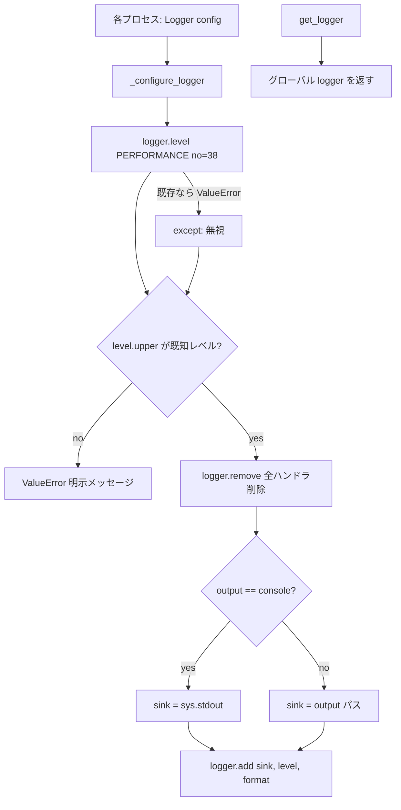

# Design — logger

> 逆生成 spec。`src/logger.py` が「どう実現されているか」を記す。コードが正。
> 関連: [`structure.md`](../../steering/structure.md)（Logger は横断ユーティリティ）、[`config-manager`](../config-manager/)（`LoggingConfig`）。

## 概要

`logger` は `loguru` をラップし、アプリ全体のログ出力を一元設定する薄いユーティリティである。`Logger(config)` を生成すると、カスタムレベル `PERFORMANCE`（🚀, `no=38`）を登録 → レベル名を検証 → `loguru` のプロセスグローバルロガーを「既存ハンドラ全削除 → 設定済みシンクを1つ追加」で再構成する。各プロセス（メイン/camera/object_tracking）は自プロセス内で `Logger` を生成し、`get_logger()` で同じグローバル `logger` を取得して使う。出典 `src/logger.py:12-50`。

設計の要点は、① **設定の集約**（出力先・レベル・フォーマット・カスタムレベルを1箇所で決める）、② **プロセスごとの再構成**（マルチプロセスで各子プロセスが独立した `loguru` を持つため）、③ **冪等なカスタムレベル登録**（再登録の `ValueError` を握りつぶす）、④ **不正レベルの早期検証**（未知レベルは明示メッセージ付き `ValueError`）の4点である。

## 責務と構成要素

| 要素 | 役割 | 出典 |
|:--|:--|:--|
| `Logger.__init__` | `LoggingConfig` を保持し `_configure_logger` を呼ぶ | `src/logger.py:13-15` |
| `Logger._configure_logger` | `PERFORMANCE` 登録→レベル検証→`remove()`→`add(sink, level, format)` | `src/logger.py:17-47` |
| `Logger.get_logger` | 設定済みグローバル `logger` を返す | `src/logger.py:49-50` |

## 公開インターフェース

```
Logger(config: LoggingConfig)        # 生成時にグローバルロガーを再構成（src/logger.py:13-15）
Logger.get_logger() -> loguru.Logger # プロセス共有の logger を返す（src/logger.py:49-50）

# 消費側の典型
log = Logger(logging_config).get_logger()
log.info(...) / log.warning(...) / log.error(...) / log.debug(...)
log.log("PERFORMANCE", "...")        # カスタムレベル（src/object_tracking_controller.py:267）
```

## データ構造 / 状態

- `Logger` の状態は `self.config: LoggingConfig` のみ。実体の状態は `loguru` のグローバル `logger`（プロセス共有 singleton）に存在する。出典 `src/logger.py:14`。
- 消費するキー: `config.output`（`"console"` or パス）、`config.level`（`upper()` でレベル名。未知レベルは検証で弾く）。出典 `src/logger.py:33,44-45`。

## データフロー / 制御フロー



- メイン: `main.py:32` が `logging` 設定で `Logger` 生成。
- ワーカー: `camera_controller.py:79` / `object_tracking_controller.py:151` が **子プロセス内 `run()`** で生成（spawn 対策）。
- 出力: `info`/`warning`/`error`/`debug` は各所、`PERFORMANCE` は `object_tracking_controller.py:267-275` から `performance_interval` フレームごと。

## 不変条件 / 前提条件

- **後勝ち再構成（蓄積しない）**: `remove()`（全削除）→`add()`（1個）のため、同一プロセスで複数 `Logger` を生成してもハンドラは常に1個で重複しない。ガードは不要。出典 `src/logger.py:42-43`。
- **プロセス分離（fork/spawn 両対応）**: spawn では子の `loguru` がまっさら、fork では親の構成を継承。いずれも子の `remove()`→`add()` 再構成で正しく動く。「構成済みスキップ」型ガードは fork でフラグ継承により再構成を飛ばし危険なため**入れない**（意図は docstring `src/logger.py:18-25` に明記済み）。出典 `src/logger.py:42-47`、`src/camera_controller.py:79`、`src/object_tracking_controller.py:151`。
- **`PERFORMANCE=38`**: `WARNING(30)`〜`ERROR(40)` の間。`INFO`/`DEBUG` で可視、`ERROR` で抑制。出典 `src/logger.py:28`。
- **冪等登録**: `logger.level("PERFORMANCE", ...)` の再呼び出しは `ValueError`。try/except で握りつぶし冪等化。出典 `src/logger.py:26-31`。
- **検証より先に登録**: `PERFORMANCE` 登録をレベル検証より前に行うため、`level: PERFORMANCE` も妥当な設定になる。出典 `src/logger.py:26-35`。

## エッジケース / 異常系

- **不正レベル文字列**: `config.level` が未知レベルだと、`logger.add` へ渡す前に明示メッセージ付き `ValueError` を送出する（R-LOG-09、**実装済み**）。`main.py` の汎用ハンドラで捕捉され終了する。出典 `src/logger.py:33-40`。
- **`output` がファイルパス**: `"console"` 以外は `loguru` がその文字列をファイルシンクとして扱い、ファイルへ出力する。**公式機能として正式化**（README 更新済み）。出典 `src/logger.py:44`。
- **同一プロセス多重生成**: `remove()`→`add()` でハンドラは常に1個に保たれ、重複しない。ガード不要（R-LOG-10）。出典 `src/logger.py:42-43`。

## トレードオフ / 設計判断

- **`loguru` グローバルに乗る**: インスタンスごとに分離せず、プロセス共有の `logger` を再構成して使う。「1プロセス1ロガー、プロセスごとに必ず再構成」が正式な前提（R-LOG-10）。`remove()`→`add()` で蓄積しないため多重生成にも頑健。
- **カスタムレベルの冪等化**: `ValueError` を握りつぶすことで、再構成や再生成が起きても安全に通す。
- **出力先の柔軟性（確定）**: console + 任意ファイルパスを公式サポート。README を実態へ更新する（コードを console 固定に寄せる案は不採用）。

## 関連コードパス

- `src/logger.py:12-50` — `Logger` 本体
- `src/main.py:32` — メインプロセスでの生成
- `src/camera_controller.py:79` / `src/object_tracking_controller.py:151` — ワーカーでの生成
- `src/object_tracking_controller.py:259,267-275` — `PERFORMANCE` ログの発火
- `src/config_manager.py:53-57` — `LoggingConfig`（level/output/performance_interval）
