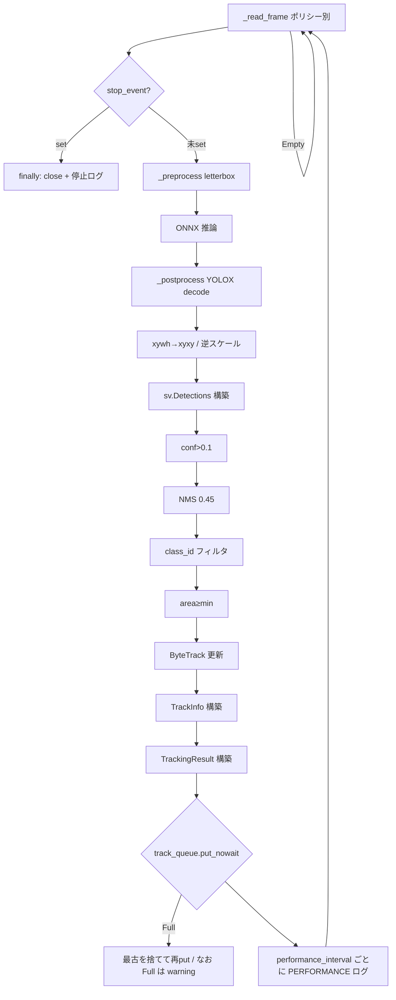

# Design — object-tracking-controller

> 逆生成 spec。`src/object_tracking_controller.py` が「どう実現されているか」を記す。コードが正。
> 関連: [`shared-frame-pool`](../shared-frame-pool/)（入力）、[`data-models`](../data-models/)（出力）、[`config-manager`](../config-manager/)・[`logger`](../logger/)。

## 概要

`object-tracking-controller` は推論+追跡のワーカープロセスである。`multiprocessing.Process` を継承し、`run()` で ONNX セッション（YOLOX）と `supervision.ByteTrack` を構築し、追跡用共有メモリプールからフレームを読み出して「前処理 → 推論 → YOLOX 後処理 → 検出フィルタ → NMS → 追跡」を回す。結果は `TrackingResult` にまとめ、`track_queue`（`multiprocessing.Queue`）で GUI に送る。出典 `src/object_tracking_controller.py:25-257`。

設計の要点は、① **読み出しポリシーで遅延/品質を制御**（`fifo`/`latest`/`bounded_latest`）、② **YOLOX 専用の前処理/後処理**を内蔵、③ **検出を段階フィルタ**（信頼度→NMS→クラス→面積）してから ByteTrack、④ **新しい結果を優先**（`track_queue` Full 時は最古を捨てる）、⑤ **協調停止 + finally 後始末**、の5点。

## 責務と構成要素

| 要素 | 役割 | 出典 |
|:--|:--|:--|
| `__init__` | 設定・spec・queue・event 保持 | `src/object_tracking_controller.py:26-42` |
| `_read_frame` | ポリシー別読み出し、戻りを3-tuple へ正規化 | `src/object_tracking_controller.py:44-66` |
| `_preprocess` | YOLOX letterbox（pad 114）+ CHW + float32 | `src/object_tracking_controller.py:68-86` |
| `_postprocess` | YOLOX grid/stride デコード（`[8,16,32]`） | `src/object_tracking_controller.py:88-108` |
| `run` | セッション/追跡器構築→ループ→送出→後始末 | `src/object_tracking_controller.py:110-257` |

## 公開インターフェース

```
ObjectTrackingController(config_manager, logging_config,
                         frame_pool_spec, track_queue, stop_event)  # :26-33
.start()   # Process 由来。GUI が呼ぶ
.run()     # 推論+追跡ループ（:110）
# 停止は共有 stop_event.set()（owner = GUI）
FRAME_READ_TIMEOUT_SEC = 0.1   # 読み出しタイムアウト（:22）
```

## データ構造 / 状態

- インスタンス: `det_config`/`track_config`/`camera_config`、`logging_config`、`frame_pool_spec`、`track_queue`、`stop_event`、`logger`。出典 `:35-42`。
- 子プロセスローカル: `session`（ONNX）、`tracker`（ByteTrack）、`frame_pool`（Accessor）、計測変数（`frame_count`/`perf_start_time`/`last_*`）。出典 `:114-137`。
- 出力: `TrackingResult`（[`data-models`](../data-models/)）。`detections` には ByteTrack 後の `sv.Detections` を格納。出典 `:213-221`。

## データフロー / 制御フロー



出典: `src/object_tracking_controller.py:138-254`。

## 不変条件 / 前提条件

- **子プロセス内構築**: Logger/Accessor/ONNX/ByteTrack は `run()` で生成。出典 `:111,114,123,130`。
- **戻り正規化**: `_read_frame` は常に `(frame_ref, image, skipped_count)`。出典 `:48-66`。
- **`frame_id` 突合**: `TrackingResult.frame_id == FrameRef.frame_id`。出典 `:214`。
- **レイテンシ恒等式**: `total == queue + process`（同一 `start_time`/`end_time`/`timestamp`）。出典 `:148-150,209-211`。
- **新しさ優先**: `track_queue` は最大 `max_queue_length`。Full 時は最古を捨て最新を入れる。出典 `:223-235`、`src/gui_controller.py:76-78`。

## エッジケース / 異常系

- **ONNX ロード失敗**: error ログ→`return`（プロセス終了）。**改修予定・機構確定**: GUI へ**専用エラー通知**（R-OTC-23、camera R-CAM-14 / [`gui-controller`](../gui-controller/) R-GUI-44 と同一機構・ステータス Queue 推奨、最終形は実装時確定）。出典 `:119-121`。
- **読み出しタイムアウト**: `Empty`→continue（フレーム未着でも CPU を無駄に回さない）。出典 `:143-144`。
- **未知ポリシー**: warning＋`bounded_latest` フォールバック。出典 `:61-66`。
- **空検出 / tracker_id None**: `track_infos` 空のまま `TrackingResult` を送出。出典 `:199-207`。
- **track_queue Full**: 最古を捨てて再 put、なお Full なら warning。出典 `:223-235`。
- **停止の二重チェック**: ループ先頭と読み出し直後で `stop_event` を確認し、停止指示への反応を速める。出典 `:139,145-146`。

## トレードオフ / 設計判断

- **読み出しポリシー**: 遅延（latest）と完全性（fifo）のトレードオフを設定で切替。既定 `bounded_latest` は「最大 `max_frame_skip` まで読み飛ばし」で両者の中庸（**推測**）。
- **段階フィルタの順序**: confidence→NMS→class→area。NMS をクラス選別前に全体へ掛ける現実装で、クラス横断の重複も抑制される（**推測**）。
- **検出閾値のハードコード（要修正）**: `0.1`/`0.45` は [`config-manager`](../config-manager/) で `detection.detection_threshold`/`nms_iou_threshold` にキー化決定済み。本モジュールで消費を差し替える。出典 `:189-190`。
- **`input_name` の毎回取得**: `:161` の `session.get_inputs()[0].name` はループ外へ巻き上げ可能（軽微）。
- **YOLOX 固定（当面の確定スコープ）**: `p6=False`・strides `[8,16,32]`・`scores=obj×cls` に依存。他モデル対応は将来の拡張テーマとし、今回は YOLOX 固定で進める。

## 関連コードパス

- `src/object_tracking_controller.py:25-257` — 本体
- `src/shared_frame_pool.py:204-271` — `read`/`read_latest`（[`shared-frame-pool`](../shared-frame-pool/)）
- `src/data_models.py:35-53` — `TrackInfo`/`TrackingResult`（[`data-models`](../data-models/)）
- `src/config_manager.py:20-37` — `DetectionConfig`/`TrackingConfig`
- `src/gui_controller.py:76-78,385-397` — `track_queue` 生成・プロセス起動
