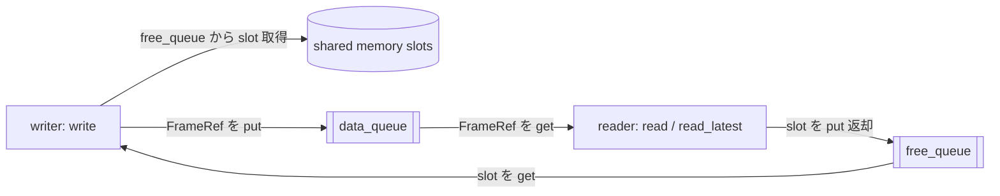

# Design — shared-frame-pool

> 逆生成 spec。source of truth は [`src/shared_frame_pool.py`](../../../src/shared_frame_pool.py)。
> 関連: [`structure.md`](../../steering/structure.md) の IPC 規約、[`data_models.py`](../../../src/data_models.py)（`FrameRef`）。

## 概要

プロセス間でカメラフレーム（大きな numpy 配列）を転送する際、`multiprocessing.Queue` で画像バイト列を pickle すると高コストになる。`shared_frame_pool` は、共有メモリ（`multiprocessing.shared_memory`）の固定 N スロットを **リングバッファ**として確保し、Queue には軽量な参照 `FrameRef`(frame_id, timestamp, slot) のみを流すことで **ゼロコピー転送**を実現する。

owner（メインプロセス）が資源を生成・所有し、writer/reader のサブプロセスは `SharedFrameSpec` を受け取って同じ共有メモリにアタッチする。遅い消費者がフレームを溜め込まないよう、書き込み側は evict-oldest、読み出し側は read_latest（最新追従）を備える。

## 責務と構成要素

| 要素 | 役割 | 出典 |
|:--|:--|:--|
| `SharedFramePool` | owner。共有メモリ・free_queue・data_queue を生成し、active 状態と reset/cleanup を管理 | `shared_frame_pool.py:67-150` |
| `SharedFrameSpec` | サブプロセスへ渡す直列化可能なハンドル（名前・shape・dtype・両 Queue） | `shared_frame_pool.py:56-65` |
| `SharedFrameAccessor` | writer/reader が共有メモリにアタッチして読み書きする | `shared_frame_pool.py:153-280` |
| `_get_nowait_with_retry` | feeder 遅延を吸収する短時間リトライ付き get_nowait | `shared_frame_pool.py:41-53` |

## 公開インターフェース

```text
# owner（SharedFramePool）
SharedFramePool(n_slots, shape, dtype, data_queue)
  .spec -> SharedFrameSpec                 # サブプロセスへ渡す（:91-99）
  .is_active / .mark_active() / .mark_inactive()   # 稼働状態フラグ（:101-111）
  .reset_free_slots()                      # 全 worker 停止後のみ。両 Queue ドレイン→再充填（:113-138）
  .cleanup()                               # 全 shm を close+unlink（:140-150）

# accessor（SharedFrameAccessor）
SharedFrameAccessor(spec)
  .write(frame, frame_id, timestamp) -> bool          # publish 成否（:167-201）
  .read(timeout=1.0) -> (FrameRef, ndarray)           # ブロック、Empty 送出（:204-218）
  .read_nowait() -> (FrameRef, ndarray)               # 非ブロック（:220-227）
  .read_latest(timeout=1.0, max_skip=None) -> (FrameRef, ndarray, skipped_count)  # 最新追従（:229-271）
  .close()                                            # shm 参照/view 解放（:273-280）
```

## データ構造 / 状態

- **3 つの資源**: ① 共有メモリ N ブロック（`self.shms`）、② `free_queue`（空きスロット番号）、③ `data_queue`（書き込み済み `FrameRef`）。出典 `:81-88`。
- **view**: accessor は各 shm の buffer に対し `np.ndarray(shape, dtype, buffer=buf)` の view を保持。読み出しは `view.copy()` を返す。出典 `:160-164,213`。
- **状態**: owner の `_active`（bool）。reset の前提を表す。出典 `:89,101-129`。

## データフロー / 制御フロー



- **write**: free_queue から slot 取得 → 無ければ data_queue 先頭を evict してその slot 再利用 → 共有メモリへコピー → data_queue に FrameRef を publish。publish 失敗時は slot を free_queue へ戻す。出典 `:167-201`。
- **read_latest**: 最初の FrameRef を timeout 付きで取得 → ブロックせず後続を get → 古い方の slot を解放し ref を更新（skipped++）→ `max_skip` 到達 or Empty で停止 → 選ばれた frame をコピーし slot 解放。出典 `:229-271`。

## 不変条件 / 前提条件

- **スロット単一所有**: slot は free_queue か data_queue の片方にのみ存在する（write は free→data、read は data→free）。出典 `:180-200,212-218,255-270`。
- **reset の前提**: `reset_free_slots()` は全 worker/accessor 停止後のみ。稼働中呼び出しは `RuntimeError`。lock を増やさず guard + 前提明示で高速パスを保つ設計。出典 `:113-138`。
- **owner/accessor の責務分離**: 生成・unlink は owner のみ。accessor は attach/close のみで unlink しない。出典 `:140-150,273-280`。

## エッジケース / 異常系

- shape 不一致 → False（書き込まない）。出典 `:175-177`。
- 空きスロットも退避対象も無い（消費者と Queue の競合）→ フレーム破棄 False。出典 `:186-187`。
- publish 時 data_queue が Full → slot を free へ戻し False。出典 `:195-201`。
- feeder 遅延で一時 Empty → `_get_nowait_with_retry` が最大 2 回/1ms 再試行。出典 `:30-53`。

## トレードオフ / 設計判断

- **lock を避け Queue + guard で構成**: 通常のフレーム転送を高速に保つため、reset のような危険操作のみ前提条件（stopped-workers）を明示して保護する。出典コメント `:118-124`。
- **evict-oldest / read_latest**: 遅い消費者が FIFO で全フレームを処理して遅延が累積するのを避け、リアルタイム性を優先する。`bounded_latest`（`max_skip` 上限）は frame_id の大ジャンプによるトラッカー不安定化を抑える妥協点。出典コメント `:240-245`。
- **リトライ予算 2回/1ms（推測含む）**: feeder のパイプ遅延を吸収しつつ、カメラ/追跡ループをブロックさせない範囲に抑える意図。worst-case 約 4ms/frame。出典コメント `:30-38`。

## 関連コードパス

- `src/shared_frame_pool.py:41-53` — `_get_nowait_with_retry`
- `src/shared_frame_pool.py:67-150` — owner
- `src/shared_frame_pool.py:153-280` — accessor
- `src/data_models.py:19-25` — `FrameRef`
